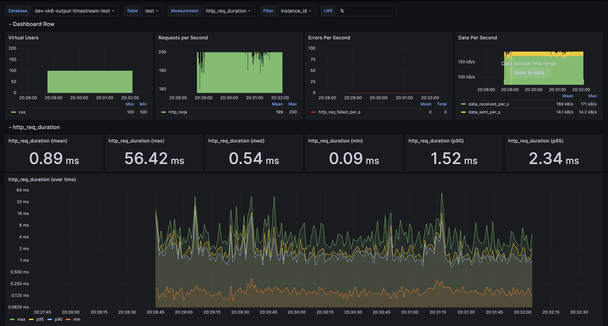
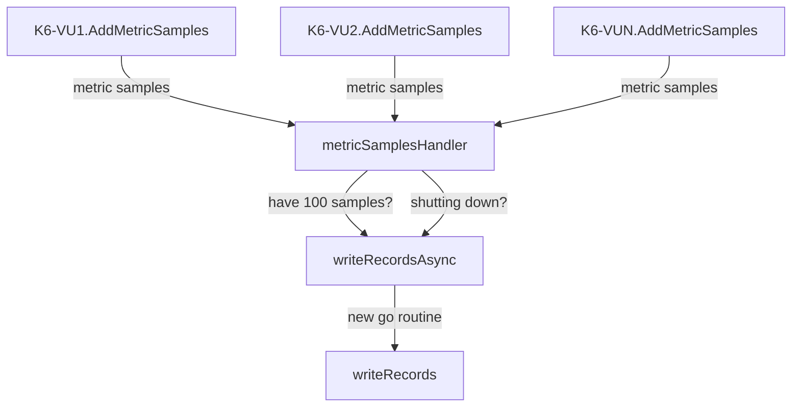
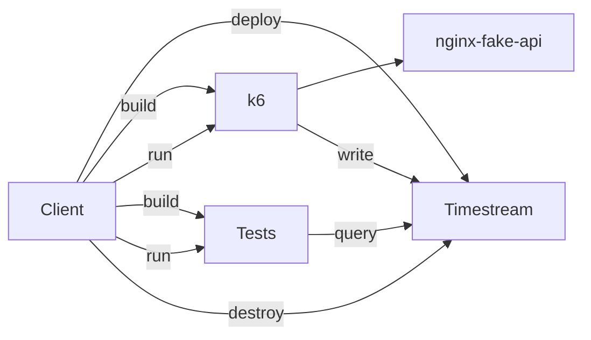

# xk6-output-timestream

Output [k6](https://k6.io/) results to [AWS Timestream](https://aws.amazon.com/timestream/) so that you can run a performant, low-cost load test.

## Why?

If you're here you've probably chosen to use k6 already and you're probably interested in using an AWS serverless service. These give you the benefits of:

- Performance at scale
- Low cost
- Great developer experience

For more information see [the alternatives](docs/Alternatives.md).

Using this extension lets you hook up K6 to AWS Timestream - plus you get a nice looking [Grafana](https://grafana.com/grafana/dashboards/) dashboard 😉 based off the [K6 Load Testing Results dashboard](https://grafana.com/grafana/dashboards/2587-k6-load-testing-results/).



## Usage

This output is written as an extension to K6 using [xk6 extensions](https://github.com/grafana/xk6).

You can use this extension by either:

- Taking the k6 executable from [the latest release](https://github.com/leonyork/xk6-output-timestream/releases) and following the [instructions on running k6](https://k6.io/docs/get-started/running-k6/).
- Using the Docker image from [the latest release](https://github.com/leonyork/xk6-output-timestream/releases) and following the [instructions on running k6](https://k6.io/docs/get-started/running-k6/).
- Building this extension into K6 - see [the custom build instructions](https://github.com/grafana/xk6#custom-builds).

### Configuration

Include the argument `--out timestream` when using the `k6 run` command - see the [K6 docs](https://k6.io/docs/get-started/results-output/#time-series-and-external-outputs)

For all configuration specific to this extension see the `Config struct` in [config.go](config.go).

The key bits of config you'll need to setup are the following environment variables

```sh
K6_TIMESTREAM_DATABASE_NAME
K6_TIMESTREAM_TABLE_NAME
```

You'll also need to setup your AWS credentials - see [the guide on how to do this](https://docs.aws.amazon.com/sdk-for-go/v1/developer-guide/configuring-sdk.html#specifying-credentials).

### Tags Usage and Requirement

The timestream record dimensions (see [timestream concepts](https://docs.aws.amazon.com/timestream/latest/developerguide/concepts.html)) for each metric emmitted by k6 are taken from any k6 tags that have non-empty values.

Every timestream record requires at least one dimension when written, and k6 applies some default tags to metrics emmitted by many core k6 JavaScript API objects such as http requests, groups and checks. However, since some metrics emitted in the global/test scope may not have any k6 default tags, you will likely see the error `At least one dimension is required for a record.` logged from timestream if you do not define at least one custom tag at the topmost scope of your script to cover metrics with no default tags, as in an options object export. More information can be found in [the K6 documentation](https://k6.io/docs/using-k6/tags-and-groups/) or an example of setting up tags can be found in the [integration test script](test/test.js).

### Grafana Dashboard

An [example dashboard](grafana/dashboards/loadtest/loadtest.json) is provided. You can use this dashboard by running `make grafana-build grafana-run`. If you are using this with your own test scripts, ensure that you include the `instance_id` and `vu` tags in your test script - see the [integration test script](test/test.js) as an example.

## Development

I use [VSCode](https://code.visualstudio.com/) for development so this will be the best supported editor. However, you should be able to use other IDEs. If you are using another IDE:

1. The [devcontainer Dockerfile](.devcontainer/Dockerfile) `ci` target shows all the tools you need for a dev environment (e.g. For linting).
2. There are [suggested tools](.devcontainer/tools.default.sh) you can also use.

### VSCode

The preferred way to develop using VSCode is to use the [dev container feature](https://code.visualstudio.com/learn/develop-cloud/containers). This will mean you have all the tools required and suggested for development.

If you do want to use different tools (e.g. you don't like the shell setup), create `.devcontainer/tools.override.sh` and base it off [.devcontainer/tools.default.sh](.devcontainer/tools.default.sh).

If you don't want to use dev containers, you'll need to make sure you install the tools from the [devcontainer Dockerfile](.devcontainer/Dockerfile) and the packages in [suggested tools](.devcontainer/tools.default.sh) that are needed for the VSCode extensions.

### Where to start for development

[output.go](output.go) contains the logic for converting from K6 metric samples to AWS Timestream records and then saving those records.

There are targets for different development tasks in [the Makefile](Makefile).

### Architecture

Metric samples are passed from each of the K6 VUs to `metricSamplesHandler`. This converts them to the format that the Timestream SDK expects and holds on to them until it has 100 records to save ([the max batch size for Timestream](https://docs.aws.amazon.com/timestream/latest/developerguide/API_WriteRecords.html)). It will then save these asyncronously by kicking off a new go-routine to perform the save.

The channel for receiving metric samples is closed at the end of the test and the left-over records are saved.



### Testing

#### Integration

The integration tests work by creating a Timestream database and table, running a load test (with a built in test script) and then checking the results.



To run the integration tests you'll need to setup AWS credentials - see [the guide on how to do this](https://docs.aws.amazon.com/sdk-for-go/v1/developer-guide/configuring-sdk.html#specifying-credentials).

To deploy the Timestream database run `make deploy-infra`.

To run the tests (build, run and query steps above) run `make test-integration`. Note that you will need to build the k6 image first with `make build-image`.

To destroy the Timestream database run `make destroy-infra`.

#### Grafana

Testing of the Grafana dashboard is manual:

1. `export K6_ITERATIONS=40000` - to get a reasonable number of results, set the number of iterations to a large number.
2. `make deploy-infra` - to deploy the infrastructure.
3. `make test-integration` - to run the tests. These will likely fail as the number of iterations is not what the tests expect.
4. `make grafana-build grafana-run` and browse to <http://localhost:3000>. From the dashboard you'll see the results come in. It should look like the dashboard near the top.
5. `make destroy-infra` - to destroy the infrastructure once you're done testing.
