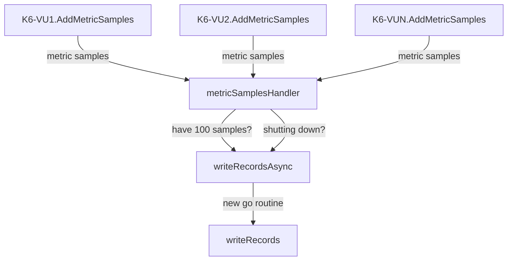
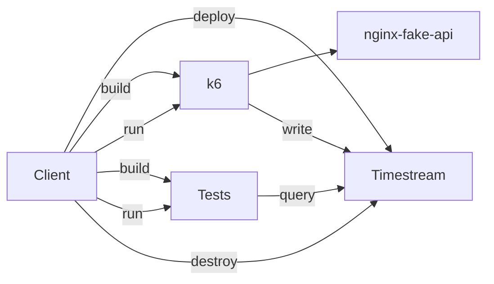

# xk6-output-timestream

Output [k6](https://k6.io/) results to
[AWS Timestream](https://aws.amazon.com/timestream/) so that you can run a
performant, low-cost load test.

## Why?

If you're here you've probably chosen to use k6 already and you're probably
interested in using an AWS serverless service. These give you the benefits of:

- Performance at scale
- Low cost
- Great developer experience

For more information see [the alternatives](docs/Alternatives.md).

Using this extension lets you hook up K6 to AWS Timestream - plus you get a nice
looking [Grafana](https://grafana.com/grafana/dashboards/) dashboard 😉 based
off the
[K6 Load Testing Results dashboard](https://grafana.com/grafana/dashboards/2587-k6-load-testing-results/).


## Usage

This output is written as an extension to K6 using
[xk6 extensions](https://github.com/grafana/xk6).

You can use this extension by either:

- Taking the k6 executable from
  [the latest release](https://github.com/leonyork/xk6-output-timestream/releases)
  and following the
  [instructions on running k6](https://k6.io/docs/get-started/running-k6/).
- Using the Docker image from
  [the latest release](https://github.com/leonyork/xk6-output-timestream/releases)
  and following the
  [instructions on running k6](https://k6.io/docs/get-started/running-k6/).
- Building this extension into K6 - see
  [the custom build instructions](https://github.com/grafana/xk6#custom-builds).

### Configuration

Include the argument `--out timestream` when using the `k6 run` command - see
the
[K6 docs](https://k6.io/docs/get-started/results-output/#time-series-and-external-outputs)

For all configuration specific to this extension see the `Config struct` in
[config.go](config.go).

The key bits of config you'll need to setup are the following environment
variables

```sh
K6_TIMESTREAM_DATABASE_NAME
K6_TIMESTREAM_TABLE_NAME
```

You'll also need to setup your AWS credentials - see
[the guide on how to do this](https://docs.aws.amazon.com/sdk-for-go/v1/developer-guide/configuring-sdk.html#specifying-credentials).

### Tags Usage and Requirement

The timestream record dimensions (see
[timestream concepts](https://docs.aws.amazon.com/timestream/latest/developerguide/concepts.html))
for each metric emmitted by k6 are taken from any k6 tags that have non-empty
values.

Every timestream record requires at least one dimension when written, and k6
applies some default tags to metrics emmitted by many core k6 JavaScript API
objects such as http requests, groups and checks. However, since some metrics
emitted in the global/test scope may not have any k6 default tags, you will
likely see the error `At least one dimension is required for a record.` logged
from timestream if you do not define at least one custom tag at the topmost
scope of your script to cover metrics with no default tags, as in an options
object export. More information can be found in
[the K6 documentation](https://k6.io/docs/using-k6/tags-and-groups/) or an
example of setting up tags can be found in the
[integration test script](test/test.js).

### Grafana Dashboard

An [example dashboard](grafana/dashboards/loadtest/loadtest.json) is provided.
You can use this dashboard by running `make grafana-build grafana-run`. If you
are using this with your own test scripts, ensure that you include the
`instance_id` and `vu` tags in your test script - see the
[integration test script](test/test.js) as an example.

### Troubleshooting

#### Building with other extensions

Between versions of K6 there can be breaking changes for extensions. So, if
you're seeing issues using this extension with another extension then first
ensure that the two extensions are using the same version of the K6 module. You
can usually find the version of the K6 module in the `go.mod` in the extension's
repo - the version will be next to the text `go.k6.io/k6`.

You may need to switch to an older version of this (or other) extensions to find
a common k6 version. To find out the versions of this extension that correspond
to particular K6 versions you can use the commit history. To do this, clone the
repo (e.g. `git clone https://github.com/leonyork/xk6-output-timestream.git`)
and run `git log --grep=go.k6.io/k6`. This will give you something that looks
like:

```sh
commit 0516c682077778489b9f50c22c7d617eb6f69dd5 (HEAD -> main)
Author: renovate[bot] <29139614+renovate[bot]@users.noreply.github.com>
Date:   Mon Nov 11 18:36:44 2024 +0000

    fix(deps): update module go.k6.io/k6 to v0.55.0

commit 2a769222eb717e028f2c4b01beec20b54d3c6ead (tag: v0.9.53)
Author: renovate[bot] <29139614+renovate[bot]@users.noreply.github.com>
Date:   Mon Sep 30 16:20:32 2024 +0000

    fix(deps): update module go.k6.io/k6 to v0.54.0
```

Here you can see which commit, and which version (see `tag`) of this extension,
included a particular version of the K6 module. For example, if you needed to
use k6 module `v0.54.0`, then you could choose `v0.9.53` of this extension.

However, you'd be better off using version just before the k6 module was
upgraded so that you have as many updates and fixes included as possible. If
you'd like to do this, you'll want to use the version of this extension that's
one below the commit that upgraded away from the version you need. For example,
if you needed to use k6 module `v0.54.0` again, but you wanted to use the latest
version of this extension supporting that version of the k6 module, then you can
see the upgrade away from `v0.54.0` (to `v0.55.0`) happens in `v0.9.62`, so
taking one version back, you'd want to use `v0.9.61` of this extension.

For more information on the versioning system this extension uses, see
[semantic versioning](https://semver.org/).

If you find that this extension isn't using the latest version of the K6 module,
you can submit a PR (although version updates are handled fully automatically by
[renovate](https://docs.renovatebot.com/)). Without a very strong reason - such
as a security vulnerability - PRs won't be accepted to roll back to a previous
version of the K6 module.

## Development

There are a few options for developing this extension:

- [VSCode](https://code.visualstudio.com/) with a
  [dev container](https://code.visualstudio.com/docs/devcontainers/containers).
  This will install all the tools you need and set you up with a zsh shell.
- Using another IDE but with [nix](https://nixos.org/) to install the tools you
  need - just run `nix develop` to open a shell with the tools installed. If you
  have [direnv](https://direnv.net/) installed, you can just browse to the repo
  and run `direnv allow` (only needed the first time).
- Installing tools manually. The tools tools needed to develop for this
  extension can be found in [dependencies.nix](./dependencies.nix). The repo
  automatically receives PRs to update weekly, so you should be able to use the
  latest versions of the tools.

### Where to start for development

[output.go](output.go) contains the logic for converting from K6 metric samples
to AWS Timestream records and then saving those records.

There are targets for different development tasks in [the Makefile](Makefile).

### Architecture

Metric samples are passed from each of the K6 VUs to `metricSamplesHandler`.
This converts them to the format that the Timestream SDK expects and holds on to
them until it has 100 records to save
([the max batch size for Timestream](https://docs.aws.amazon.com/timestream/latest/developerguide/API_WriteRecords.html)).
It will then save these asyncronously by kicking off a new go-routine to perform
the save.

The channel for receiving metric samples is closed at the end of the test and
the left-over records are saved.



### Testing

#### Integration

The integration tests work by creating a Timestream database and table, running
a load test (with a built in test script) and then checking the results.



To run the integration tests you'll need to setup AWS credentials - see
[the guide on how to do this](https://docs.aws.amazon.com/sdk-for-go/v1/developer-guide/configuring-sdk.html#specifying-credentials).

To deploy the Timestream database run `make deploy-infra`.

To run the tests (build, run and query steps above) run `make test-integration`.
Note that you will need to build the k6 image first with `make build-image`.

To destroy the Timestream database run `make destroy-infra`.

#### Grafana

Testing of the Grafana dashboard is manual:

1. `export K6_ITERATIONS=40000` - to get a reasonable number of results, set the
   number of iterations to a large number.
2. `make deploy-infra` - to deploy the infrastructure.
3. `make test-integration` - to run the tests. These will likely fail as the
   number of iterations is not what the tests expect.
4. `make grafana-build grafana-run` and browse to <http://localhost:3000>. From
   the dashboard you'll see the results come in. It should look like the
   dashboard near the top.
5. `make destroy-infra` - to destroy the infrastructure once you're done
   testing.
